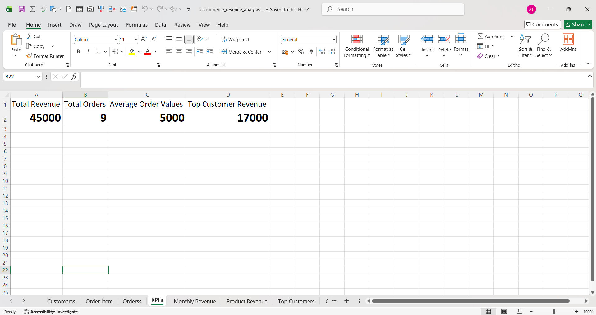
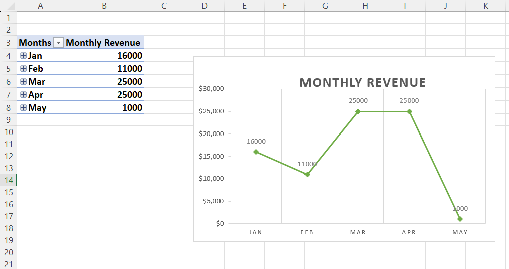
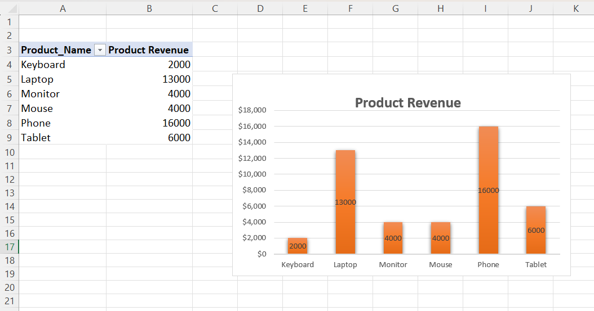
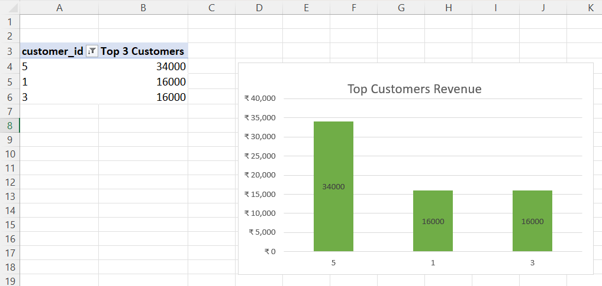

# E-Commerce Revenue Analysis

## Tools Used :
* PostgreSQL (pgAdmin)
* SQL
* Microsoft Excel

## Description :
This project analyzes e-commerce transaction data using SQL and Excel to derive insights related to revenue trends, customer behavior, and product performance.

## Key Analysis :
* Customer lifetime value analysis
* Monthly revenue trends
* Product-wise revenue analysis
* Identification of top customers
* Contribution of customers to total revenue

## 📊 Excel Dashboard :

### KPI Overview :

### Monthly Revenue Trend :

### Product Revenue Analysis :

### Top Customers Analysis :

## 📁 Project Files :
* `ecommerce_revenue_analysis.sql` – SQL queries for data analysis
* `ecommerce_revenue_analysis.xlsx` – Excel dashboard and data
* `images/` – Dashboard screenshots
## Conclusion

This project demonstrates how SQL and Excel can be used together to perform data analysis and extract meaningful business insights such as revenue growth, top-performing products, and high-value customers.
